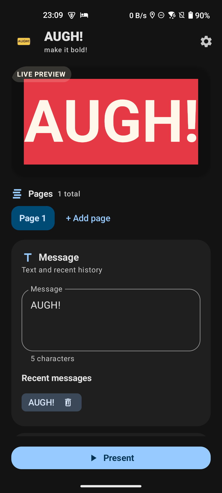

# AUGH!

<p align="center">
  
</p>

<p align="center"><strong>Make a sign. Make it loud. Make it extremely unnecessary.</strong></p>

AUGH! (pronunciation: an exasperated yell, like you just stubbed your toe on the doorframe -
picture the word in a comic-strip speech bubble and you've got it) is a colorful Android sign
maker for custom full-screen text. Build a deck of pages, choose an absurd presentation style,
and swipe through it when the moment arrives.

## Features

- Edit and Present modes with immersive landscape presentation.
- Multiple pages with add, delete, select, and reorder controls.
- Auto-fit typography that recalculates for the available portrait or landscape canvas.
- Modern, display, editorial, and mono font choices with vertical-position controls.
- Rich text/background palettes, including red, presets, and recent messages.
- Still, scrolling, text blinking, background flashing, invert, and opt-in full-strobe motion.
- Optional PowerPoint-era page transitions: fade, wipe, blinds, checkerboard, and spin.
- Optional tap actions: invert, flash, beep, or advance to the next page.
- Reduced-motion handling, keep-screen-awake presentation, and local persistence.

## Automation intents

Other Android apps can launch or control AUGH! through the exported `MainActivity`. The action
names are also available as `AughIntents` when depending on the app's source/API constants.

- `dev.pschmitt.augh.action.PRESENT` starts full-screen Present mode. Pass `EXTRA_TEXT` or
  `EXTRA_PAGES`, plus optional styling extras such as `EXTRA_FOREGROUND`, `EXTRA_BACKGROUND`,
  `EXTRA_FONT`, `EXTRA_ANIMATION`, `EXTRA_SPEED`, `EXTRA_BLINK_INTENSITY`, `EXTRA_TRANSITION`,
  `EXTRA_TAP_ACTION`, and `EXTRA_KEEP_SCREEN_AWAKE`.
- `dev.pschmitt.augh.action.NEXT_PAGE` and `PREVIOUS_PAGE` switch presentation pages.
- `dev.pschmitt.augh.action.TRIGGER_ACTION` performs the configured tap action as if the
  presentation had been tapped.

`EXTRA_PAGES` accepts either a `StringArrayList` or a `String[]`; `EXTRA_TEXT` also accepts the
standard `android.intent.extra.TEXT`. Enum styling values use their names, for example `RED`,
`CREAM`, `SANS`, `BLINK`, `FADE`, or `NEXT_PAGE`. Speed and blink intensity are floats from
`0.0` to `4.0` (with high-intensity mode required above `1.0`), and keep-screen-awake is a boolean. A simple shell example:

```sh
adb shell am start -n dev.pschmitt.augh/.MainActivity \
  -a dev.pschmitt.augh.action.PRESENT \
  --es dev.pschmitt.augh.extra.TEXT "PLEASE WAIT" \
  --es dev.pschmitt.augh.extra.FOREGROUND RED
adb shell am start -n dev.pschmitt.augh/.MainActivity \
  -a dev.pschmitt.augh.action.NEXT_PAGE
```

## Screenshots

<p>
  
  
</p>

## Install

Not published on Google Play or F-Droid yet. Install and auto-update via Obtainium, or download
an APK directly from the [releases page](https://github.com/pschmitt/augh/releases).

[][obtainium-link]

The badge follows the rolling `latest` prerelease and selects the non-debug release APK.

[obtainium-link]: https://apps.obtainium.imranr.dev/redirect?r=obtainium://app/%7B%22id%22%3A%22dev.pschmitt.augh%22%2C%22url%22%3A%22https%3A%2F%2Fgithub.com%2Fpschmitt%2Faugh%22%2C%22author%22%3A%22pschmitt%22%2C%22name%22%3A%22augh%22%2C%22preferredApkIndex%22%3A0%2C%22additionalSettings%22%3A%22%7B%5C%22includePrereleases%5C%22%3Atrue%2C%5C%22fallbackToOlderReleases%5C%22%3Atrue%2C%5C%22apkFilterRegEx%5C%22%3A%5C%22augh-.%2A-release%5C%5C%5C%5C.apk%24%5C%22%2C%5C%22invertAPKFilter%5C%22%3Afalse%2C%5C%22autoApkFilterByArch%5C%22%3Atrue%2C%5C%22trackOnly%5C%22%3Afalse%7D%22%7D

### Google Play publishing

The `Play Store` workflow publishes signed Android App Bundles to the internal-testing track when
a semantic-version tag such as `1.0.0` is pushed. Version codes are derived from the tag, so each
new semantic version produces a higher Play version code.

Before the first tag, complete the one-time setup:

1. In Google Cloud, create a project, enable the Google Play Developer API, and create a service
   account.
2. In Play Console, grant that service account access to AUGH! with permission to release to
   testing tracks, then download its JSON key.
3. Create a persistent upload keystore, enroll in Play App Signing during the first release, and
   keep the keystore safe. The same upload key must be used for every CI bundle.
4. Add these GitHub repository secrets: `PLAY_SERVICE_ACCOUNT_JSON`, `CI_KEYSTORE_BASE64`,
   `CI_KEYSTORE_PASSWORD`, `CI_KEY_ALIAS`, and `CI_KEY_PASSWORD`.
5. Finish the Play Console app content, store listing, declarations, and internal-testers setup.

The workflow currently targets internal testing; promote it to production only after the first
internal release has been tested and Play Console requirements are complete.

Privacy policy: [PRIVACY.md](https://github.com/pschmitt/augh/blob/main/PRIVACY.md).

## Development

Gradle builds intentionally run on `rofl-13` or `rofl-14`, not on the local workstation:

```sh
just check
just build
just deploy-all
```

`just deploy-all` fetches the remote debug APK and installs it on every attached ADB device.
The debug application id is `dev.pschmitt.augh.debug`.

See [AGENTS.md](AGENTS.md) for repository conventions and [TODO.md](TODO.md) for the running
backlog. This project is licensed under [GPL-3.0](LICENSE).
